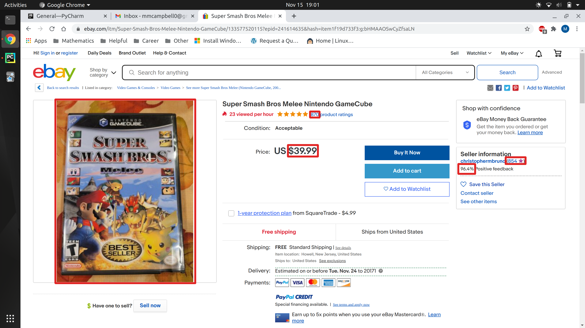
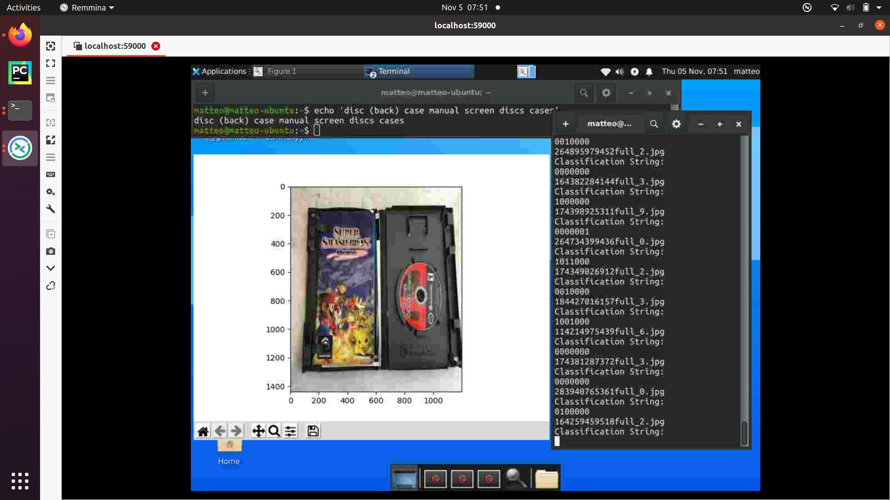

# ebuy (for lack of a better name)
## Introduction
An independent project to determine driving factors in Ebay selling prices for a personal favorite game of mine: "Super Smash Bros. Melee, 2001."  
The motivation here is to build a full-fledged, end-to-end Data Science project. This includes the data collection process, proper data storage, data exploration/visualization, data wrangling, and an informative model. Beyond this, Git version control and more standard software developer practices will be used in my pursuit to not be another hacky data monkey who can kind of code.
## 1. Data Collection
Aspiring data scientists and ML-practitioners get much of their training from sources like Kaggle. While this is a great resource, it is typically not indicative of real world data. Data from the world is ugly, brutish, and fragmented. To simulate this as best as possible, we go straight to the horse's mouth.

Raw. Data.

Luckily, the internet is chock-full of the stuff. My first attempt to start siphoning data off of Ebay was the more standard approach of working through an API. However, the Ebay API doesn't give you access to quite everything on an item listing. It *may* have been possible to acquire all of the info through complex API navigation, but the Ebay API docs are so mucky and inconsistent that I felt it more worthwhile to write a web-scraper that gives me full control over what data comes in to the system.

A quick ethical note: web scraping isn't exactly a nice thing to do. Aggressive querying of the same servers can cause performance issues for the company, and they may blacklist your IP if they identify you as a problem. Even if you circumvent this by using proxy services like I did, be kind and throttle your requests.

**Sample Smash Bros. Listing**

We'll gather data from listings like the one above. For example, we'll pull the final selling price, the seller score, and the seller's feedback percentage. There are numerous other pieces of info that are retrieved, such as the seller's custom text description, but you get the gist. See the data_collection module for the details.

Besides the text-based data gathered above, it's noteworthy that the data_collection module also allows for downloading the item images, a core component of the modeling process.

All of this data is then fed into a local PostgreSQL database. This is done in a batching process across all of the available listings that have been sold and are not already in the database. Combining this with a CRON job on a UNIX system fully automates this portion of the pipeline.  Refer to the conf.yaml file to setup connection options for PostgreSQL (ports, etc.).

After all was said and done, I started analyzing data with approximately 1500 listings. This is a **small** dataset. Terribly small. However, this particular item does not sell that frequently, so at any given time there are only approximately 600 unique listings (already sold, mind you). After about 4 months of data collection, I began analyzing. I kept in mind that the root of my future problems would come from the size of the dataset.

## 2. Image Handling
The images. Oh, the images. There were approximately 6000 images to go alongside the PostgreSQL data. The images tell a lot about the item listed. For instance, they can tell you if the item includes all the expected components, (Game case, disc, manual). They can tell you if the listing isn't even the item you are after, thus providing a powerful filter before modeling. However, 6000 is far too small to get anything meaningful out of an unsupervised learning method, and the features to be extracted are too helpful to be ignored.

So we resort to the only option. Manual labeling. I recommend never doing this if you want to retain sanity.

The data_collection/image_labeling.py script provides a kind interface to sift through the downloaded images and label relevant features. Below is a screenshot of the script in action.

**Image Feature Extraction**

The features extracted from the images included Correct Disc, Backside of Disc, Correct Case, Correct Manual, Television Screenshot, Multiple Discs, and Multiple Cases. The last two features are useful in filtering out *bundled items*, listings where the seller is combining many games as one item. We want to limit our working dataset to only Super Smash Bros Melee listings.

## 3. Text Processing
The top two telling components of a listing are the images and the seller's text description. Naturally, we want to dissect the latter piece via NLP techniques. Again, given the small size of the dataset, we can't delve into anything *too* sophisticated.

We'll clean up the text and make it more uniform:

1. Remove punctuation
2. Remove stop words like 'a' or 'that'
3. Lemmatize each word: 'ran' -> 'run'

With all the text cleaned up, we then focus in on the words that show up enough to be worth calling  a feature, but not so frequently that it doesn't tell us anything about the listing. The specific criterion I selected was words, specifically 2-gram word combinations, with a **document frequency** in the range [0.02, 0.65]. This produced approximately 250 unique word features, which were then filled with counts (divided by document frequency for tf-idf) of each word on a per-listing basis.

## 4. Data Visualization
Before any sort of modeling occurs, it is necessary to become more acquainted with the data at hand. Relevant visuals such as response (selling price) distribution, how response varies with particular features, and checks for multicollinearity are all captured in one, clean dashboard utilizing Streamlit. The more and more I use Streamlit, the more fond of it I become. See below for a sample screenshot.

 
 
 Above, you see the response distribution in a simple matplotlib style. Had the dashboard been the main focus of this project, a more visually appealing package like seaborn or plotly could have been used, but since I'm only interested in a few basic exploratory questions, it's fine as is. A particularly useful feature of Streamlit, however, is it's ability to incorporate filters. For instance, above I am able to tie in an image-based filter that catches most of the non-"Super Smash Bros. Melee" items. Useful!
## 5. Final Data Prep
There are still a few more tidying steps required before we can get to the models.

First, we filter out items that have images that meet either of the below conditions.
* None of the images contain the correct case, correct disc, or correct manual.
* Any of the images contain multiple discs or multiple cases.

This helps ensure our dataset consists only of the specific item we want. Otherwise there will be added variance to the selling price for features beyond the scope of our initial question.

Second, we join in both the NLP Bag-of-Words-like features and the image features  to the main dataset. A few left-joins here does the trick.

Lastly, we need to account for missing values. As with all real world data, there were missing values galore. Each column was handled on a case-by-case basis. Some columns made the most sense for a simple mean or median imputation, some had such scarce NaNs that it was appropriate to drop a few rows, while other times it made sense to create the new category of "Missing". See modeling/data_handling_notes.txt for the details.
## 6. Modeling
It is worth restating the goal of this project. It is not to produce the best predictive model for new items. The goal is to determine which factors within a listing drive its selling price. This means that we must have some sense of interpretability to go alongside the model. That being said, we must bid farewell to any hopes of Neural Nets (we don't have nearly enough data for this anyways) or Random Forests.

So what are we left with as options? Moving from least interpretable to most, a selection of options includes Support Vector Regression, Decision Trees (Gradient Boosting is an option depending on *how* interpretable we want to get), or something more vanilla like a penalized linear regression.

After some experimentation, it became clear that the performance of Support Vector Regression and Decision Trees didn't offer enough of a boost in performance. Therefore, I moved forward with fitting a linear regression with Elastic Net penalty to the data.

5-fold cross validation on the (normalized) data with a hyper-parameter search showed that only the L1 portion of the penalty was improving validation errors, so we end up with a simple Lasso penalty instead using alpha = 0.225.

From the Lasso regression coefficients, we can answer the question of "which factors drive price". The largest, positive coefficients were linked to the features: 
* Condition is 'Like New' (ideal)
* Image Features indicating that the Case and Manual were included
* The keywords ['gamecube 2001', 'tested', 'complete', 'excellent', 'item'] were included in the description.

Intuitively, these features make sense as being the key drivers in the selling price: people are more confident in buying something that is **complete** and in **ideal condition**.

A similar analysis shows that the key factors driving the price **down** include:
* Condition is 'Acceptable' (the worst condition available)
* Condition is 'Good' (one tier above 'Acceptable')
* The keywords ['not', 'has scratch', 'need', 'no', 'disk', 'well'] are included in the item description.

Most of these factors are intuitive also: they show that something about the item is lacking. (The keyword of 'well' being negative is puzzling, however).

## 7. Additional Modeling Effort

Having gone through the struggle of webscraping and building a full dataset, I wanted to continue modeling beyond the initial question. Now, I wanted to see how well, if at all, could I model the predicted selling price.

My initial attempts at modeling (SVR, Regression Trees, Lasso) showed modest improvements on the baseline Root Mean Squared Error (RMSE).

* Baseline RMSE: 9.934
* SVR: 8.902
* Regression Tree: 8.791
* Lasso: 8.884

The minor differences in the modeling errors led me to accepting the Lasso (as it was easily interpreted for the intent of this project). However, I believed that regression trees were still likely to be a good answer for lowering prediction errors.

A big problem at hand was that most of the features within the model were *categorical*. While trees can handle categorical variables in a one-hot-encoding, the model still tends to suffer in performance due to their existence.

After a bit of research, [CatBoost](https://catboost.ai/) rang true as the best developed Gradient Boosting Tree implementation that would work well with this dataset. The largest benefits included easy integration with Python as well as ready handling of categorical features.

With some experimenting and tweaking, the CatBoostRegressor proved better than the other models:

* CatBoostRegressor RMSE (averaged over 5-folds): 8.786

There is more tweaking and improvement that could be done in the future. Next steps would include exploring PCA dimensionality reduction prior to model fitting to see if this improves test error. However, I am likely ending this exploratory project with these results. See the ending remarks below.

## 8. Ending Thoughts

Overall, I gained a good chunk of data science wisdom throughout this process. I set out to collect raw data, build out a functioning data pipeline that fed into a proper database, and build a model on top of it all to assess what really drives Super Smash Bros. selling prices.

Though I hit my mark in answering the question, there are a couple of fundamental lessons that I have taken away from this:
1. Datasets that have already been built have **tremendous** value. It sucks having to build one out yourself.
2. Quality data is harder to obtain than you'd imagine.
3. At the end of the day, data quality and dataset size will drive your model's performance more than fine-tuning ever will.

The final point above is the real reason I have to stop the modeling efforts on this project: I chose an Ebay item that just doesn't see enough data to be modeled in a reasonable amount of time.
On average, approximately 100 new Super Smash Bros. listings ended up being sold. The dataset, therefore, would not grow much over time.

Still, this project served as a good challenge for me to test my wits on a small dataset. I learned a large amount about image and language feature extraction, tools that will prove
invaluable in the future.    